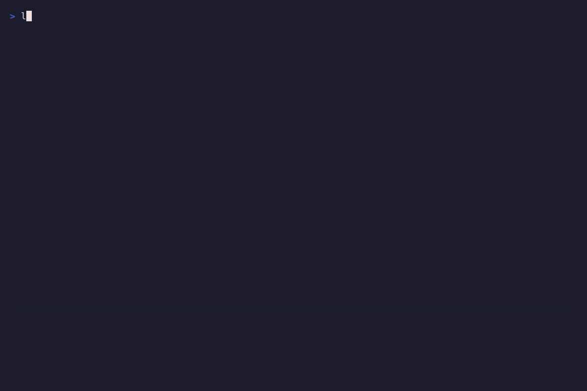

# Rollwave

**The missing deployment tool for Docker Swarm.**

[](https://goreportcard.com/report/github.com/rollwave-dev/rollwave)
[](https://opensource.org/licenses/MIT)



Rollwave brings the developer experience of modern PaaS (like Vercel or Heroku) to your own servers running Docker Swarm. It handles the complexity of zero-downtime deployments, secret rotation, and build pipelines, so you don't have to write messy Bash scripts.

> ⚠️ **Status: Alpha / MVP.** APIs and behavior may change.

## Why Rollwave?

Docker Swarm is excellent for simple orchestration, but it lacks modern tooling. Rollwave solves the biggest pain points:

- **🔐 Zero-Downtime Secret Rotation:** Native Swarm services cannot easily rotate secrets without downtime. Rollwave implements an *Immutable Secret Pattern*, hashing your secrets and updating services seamlessly.
- **🏗️ Integrated Build Pipeline:** No need for separate CI scripts. Rollwave reads your `docker-compose.yml`, builds your images, pushes them to your registry, and deploys them in one go.
- **🌍 Multi-Environment Support:** Deploy to staging and production from a single config using simple overrides.
- **👀 Stack Visibility:** Instantly check the health, image versions, and ports of your running services with a simple CLI command.
- **🧹 Auto-Cleanup:** Automatically prunes old, unused secrets to keep your cluster clean.
- **📄 Single Source of Truth:** Uses your existing `docker-compose.yml` as the definition for both building and deploying.

## Installation

### Option 1: Download Binary (Recommended)

You can download the pre-compiled binary for your operating system (Linux, macOS, Windows) from the **[Releases page](https://github.com/rollwave-dev/rollwave/releases)**.

**Linux / macOS:**
1. Download the archive (e.g., `rollwave_..._linux_amd64.tar.gz`).
2. Extract the binary.
3. Move it to your path:
   ```bash
   tar -xvf rollwave_*.tar.gz
   sudo mv rollwave /usr/local/bin/
   ```

**Windows:**
1. Download the `.zip` archive.
2. Extract it and add the folder to your PATH.

### Option 2: Build from Source

If you have Go 1.22+ installed, you can build the latest version directly:

```bash
git clone https://github.com/rollwave-dev/rollwave.git
cd rollwave
go build -o rollwave ./cmd/rollwave

# Optional: Move to your path
sudo mv rollwave /usr/local/bin/
```

## Quick Start

### 1. Initialize a Project

Go to your project directory (where your `docker-compose.yml` is) and run:

```bash
rollwave init
```

This creates a `rollwave.yml` configuration file. Edit it to match your project name.

### 2. Configure Secrets

Rollwave reads secrets from your environment or a `.env` file. Any variable starting with `ROLLWAVE_SECRET_` will be processed.

**`.env`**
```bash
# Define your secrets here
ROLLWAVE_SECRET_DB_PASSWORD="super-secret-password"
ROLLWAVE_SECRET_API_KEY="abcdef123456"
```

**`docker-compose.yml`**
Reference these secrets in your compose file using their logical names (without the prefix):

```yaml
version: "3.8"
services:
  web:
    image: my-registry.com/my-app
    build: 
      context: .
    secrets:
      - source: DB_PASSWORD
        target: db_password

secrets:
  DB_PASSWORD:
    external: true
```

### 3. Deploy

To build your image, push it, sync secrets, and deploy to Swarm:

```bash
# Ensure you are pointing to your Swarm manager
export DOCKER_HOST=ssh://user@your-swarm-manager

# Run the magic
rollwave deploy --build
```

### 4. Check Status

See the health of your stack immediately:

```bash
rollwave status
```

Output:
```text
🌍 Environment: production (default)
📦 Stack:       my-project-prod

SERVICE   REPLICAS   IMAGE                       PORTS
web       2/2        my-registry.com/app:v1      8080->80/tcp
db        1/1        postgres:14                 -
```

## Advanced Features

### Multi-Environment Deployment

Rollwave allows you to define multiple environments (e.g., `staging`, `production`) in a single `rollwave.yml`. You can override stack names, secret prefixes, and inject environment variables.

**`rollwave.yml` example:**

```yaml
version: v1
project: my-project

# Defaults (e.g. Production)
stack:
  name: my-project-prod
  compose_file: docker-compose.yml

secrets:
  stack_prefix: prod

deploy:
  with_secrets: true
  prune: true # Automatically delete unused secrets after successful deploy

# Default variables (injected into docker-compose as env vars)
variables:
  APP_PORT: "8080"

# Environment overrides
environments:
  staging:
    stack:
      name: my-project-staging
    secrets:
      stack_prefix: staging
    variables:
      APP_PORT: "8081"
```

To deploy and check a specific environment:

```bash
# Deploy to Staging
rollwave deploy --env staging --build

# Check Staging status
rollwave status --env staging
```

### Private Registries

If your images are stored in a private registry (GitHub Container Registry, GitLab Registry, AWS ECR, etc.), set the following environment variables:

```bash
export ROLLWAVE_REGISTRY_USER="your-username"
export ROLLWAVE_REGISTRY_PASSWORD="your-token-or-password"
```

Rollwave will automatically log in, push the built image, and pass the authentication credentials to the Swarm cluster.

### Cleanup

Over time, secret rotation creates many versions.

**Automatic Cleanup:**
Add `deploy: prune: true` to your `rollwave.yml` to automatically delete unused secrets after every successful deployment.

**Manual Cleanup:**
```bash
rollwave prune --env staging
```

## Roadmap

- [x] Support for Private Registry Authentication (`docker login` / config.json)
- [x] Multi-environment support (staging/production in one config)
- [x] Automatic `prune` after successful deploy
- [x] Stack status command (`rollwave status`)
- [ ] Binary releases via Homebrew

## License

MIT